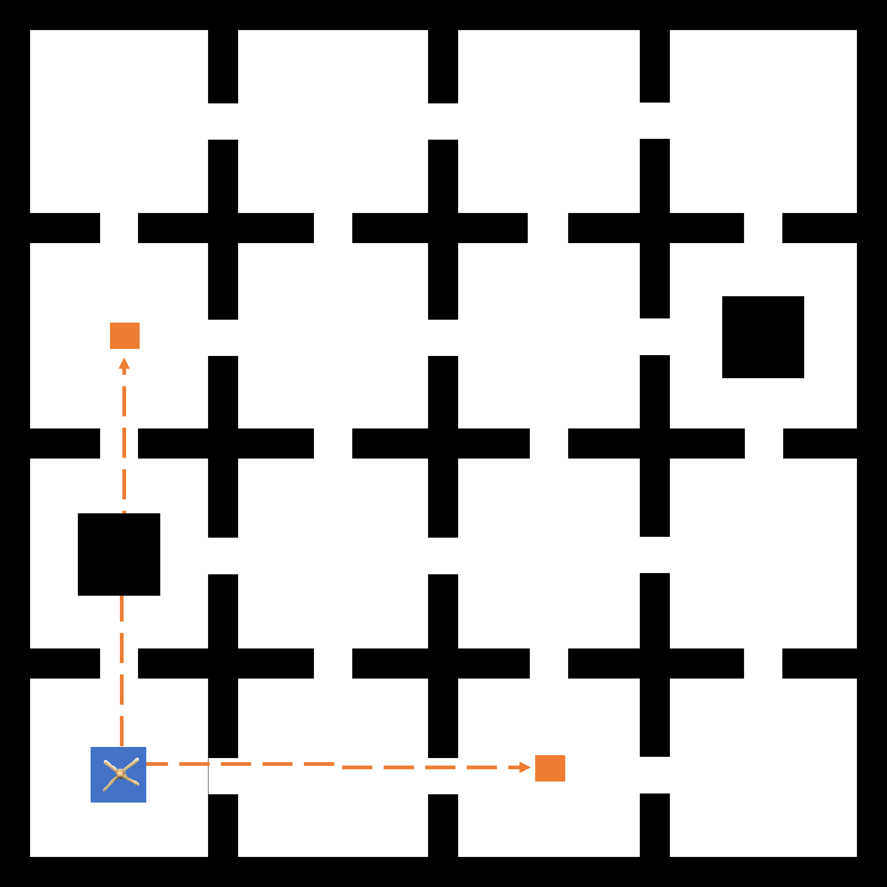
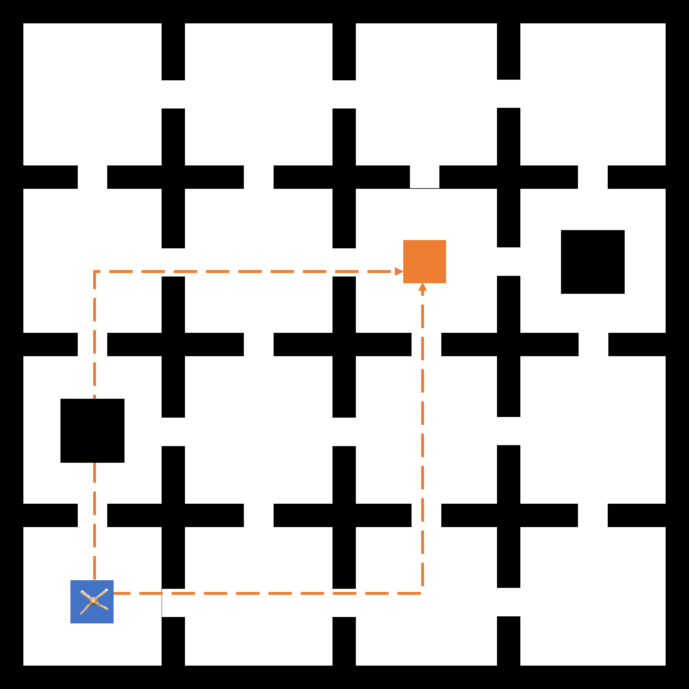
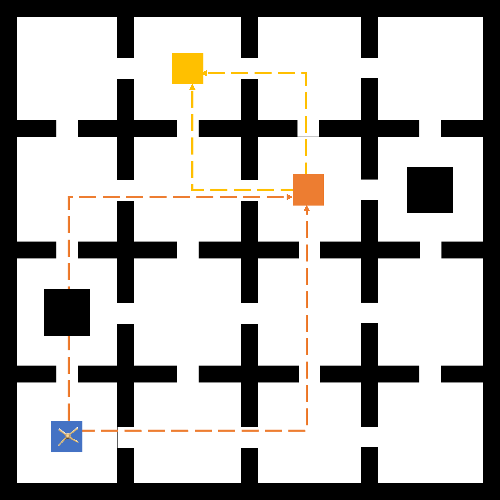

# GCRL-LTL

## Setup

Environment for Ant16rooms experiment is developed mainly based on the following version of packages:
```
	numpy=1.18.5
	torch=1.5.1
	gym=0.13.1
	mujoco_py=2.0.2.5
```
along with MuJoCo simulator version `mujoco200` from [MuJoCo release website](https://www.roboti.us/download.html)

1. Docker
	Out environment is designed based on the environment used in [GCSL](https://github.com/dibyaghosh/gcsl). To download the docker image:
	
	```
	docker pull dibyaghosh/gcsl:0.1
	```
2. Conda
	For conda environment setting-up, please refer to [conda_environment.yml](.\ant\misc\conda_environment.yml) for all specific version of packages.
3. Python(pip)
	For python pip packages, please refer to [python_requirement.txt](.\ant\misc\python_requirement.txt) for all specific version of packages.
	
	
## Run

Add workspace directory to PYTHONPATH:
```
export PYTHONPATH="${PYTHONPATH}:{path_of_GCRL-LTL_ant_folder}"
```

##### step1: Generate graph

```
python RRT_star/Generate_graph.py ant16rooms
```

##### step2: Finetune value policy

```
python RRT_star/Finetuning_with_graph.py ant16rooms
```

##### step3: reinforcement learning

```
python RRT_star/SL_rrts_tree.py ant16rooms {num_trajectories} {iterations_of_training}
```
##### step4: Testing with LTL specifications

```
python RRT_star/Testing_LTLSpecs_with_graph_ant16rooms.py ant16rooms {#ofspecification}
```
specification phi1 to phi5 is corresponding to # 9 to 13 as input
## To provide new spec 

##### predication
we keep on using 4 kind of precidation items which are used in [SPECTRL](https://github.com/keyshor/spectrl_tool):
```
ev, seq, choose, alw
```
By combining these 4 items, people can generate specifications for testing.
##### Examples 


For example, specification phi2 (#10) means to reach the orange goal starting from blue by following either of the two orange dot lines.
```
spec10  = seq(
			choose(
            	ev(in_room((2, 0))),
            	ev(in_room((0, 2)))
         	),
         	ev(in_room((2, 2)))
          )
```

## Specifications and results shown in Gifs

##### specification phi1
<p float="left">
  
  
</p>


##### specification phi2

<p float="left">
  
  
</p>

##### specification phi3

<p float="left">
  
  
</p>

##### specification phi4

<p float="left">
  
  
</p>

##### specification phi5

<p float="left">
  
  
</p>