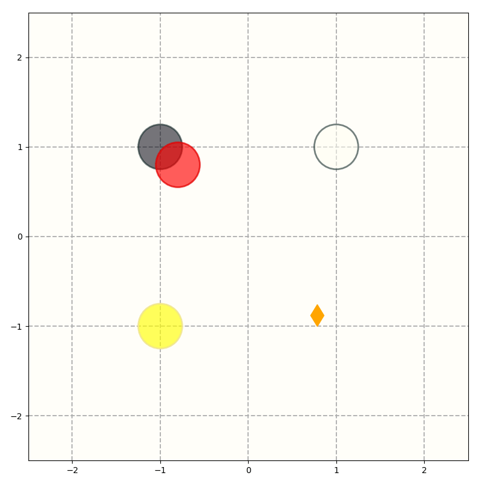
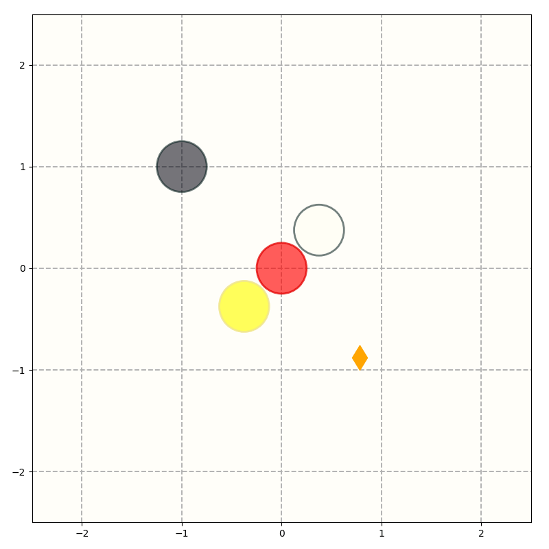

# GCRL-LTL


## ZONES

### Requirements
* Using conda and install [spot](https://spot.lre.epita.fr), see also [this](https://anaconda.org/conda-forge/spot).
    ```bash
    conda install -c conda-forge spot
    ```
* Install [mujoco](https://www.roboti.us) and [mujoco-py](https://github.com/openai/mujoco-py). 
* Install [safty-gym](https://github.com/openai/safety-gym).
* Install required pip packages
    ```
    numpy
    torch
    stable-baslines3
    graphviz
    pygraphviz
    gym
    mujoco-py
    ```

### Training (optional)
* Training primitive action policies for `ZoneEnv`, including `UP`, `DOWN`, `LEFT`, and `RIGHT`:
    ```
    python train_primitives.py
    ```
* Training goal-conditioned policy for solving LTL formulas in `ZoneEnv`, where 8 zones presents in the environment:
    ```bash
    python train_gc_policy.py
    ```
### Evaluation
* Primitive action policies for navigating the `Point` robot are saved in:
    ```
    [project_base]/zones/models/primitives/*.zip
    ```
* Trained goal-conditioned policies are saved in:
    ```
    [project_base]/zones/models/goal-conditioned/best_model_ppo_[N].zip
    ```
    where `N` denotes the number of zones presents in the environment (8 by default).

### Experiments
* Avoidance experiments
    ```bash
    python experiments/avoidance.py
    ```
* Goal-chaining experiments
    ```bash
    python experiments/chaining.py
    ```
* Stability experiments
    ```bash
    python experiments/stable.py
    ```
    See scripts in `[project_base]/zones/experiments` for more details including specifying `eval_repeats` and `device`, etc.

### Examples
* The left and right figures show the trajectory for solving avoidance task $\neg y U (j \wedge (\neg wUr))$.
<figure>
<p align='center'>


<center>
<hr><br>
</figure>

* The left and right figures show the trajectory for solving avoid more task $F((\neg y \wedge j) \wedge F(\neg y \wedge \neg w \wedge r))$.
<figure>
<p align='center'>
    
    
</p>
<center>
<hr><br>
</figure>

* The left and right figures show the trajectories for solving goal chaining task $F(j \wedge F(w \wedge F(r \wedge Fy)))$.
<figure>
<p align='center'>
    
    
</p>
<hr><br>
</figure>

* The left and right figures show the trajectories for solving traverse task $GF(r \wedge XF y) \wedge G(\neg w)$.
<figure>
<p align='center'>
    
    
</p>
<hr><br>
</figure>

* The left and right figures show the trajectories for solving stability task $FGy$.
<figure>
<p align='center'>
    
    
</p>
<hr><br>
</figure>

* The left figure shows the trajectory for solving task $F(j \wedge r)$.
* The right figure shows the trajectory for solving task $F(j \wedge \neg r)$.
<figure>
<p align='center'>
    
    
</p>
<hr><br>
</figure>

* The left figure shows the trajectory for solving task $GFw \wedge GFy$.
* The right figure shows the trajectory for solving task $GFw \wedge GFy \wedge G(\neg j)$
<figure>
<p align='center'>
    
    
</p>
<hr><br>
</figure>

* The figure shows the trajectory for solving avoid all task $Fj \wedge (\neg r \wedge  \neg y \wedge \neg w)Uj$
<figure>
<p align='center'>
    
</p>
<hr><br>
</figure>

### References
* spot, https://spot.lre.epita.fr
* LTL2Action, https://github.com/LTL2Action/LTL2Action
* gltl2ba, https://github.com/PatrickTrentin88/gltl2ba
* safety-gym, https://github.com/openai/safety-gym
